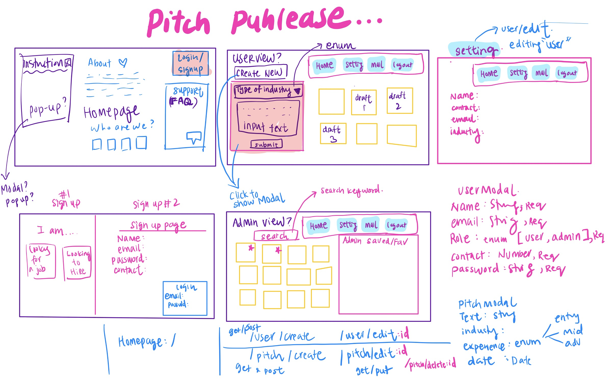
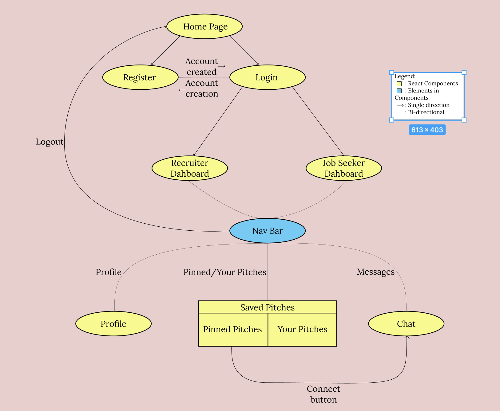
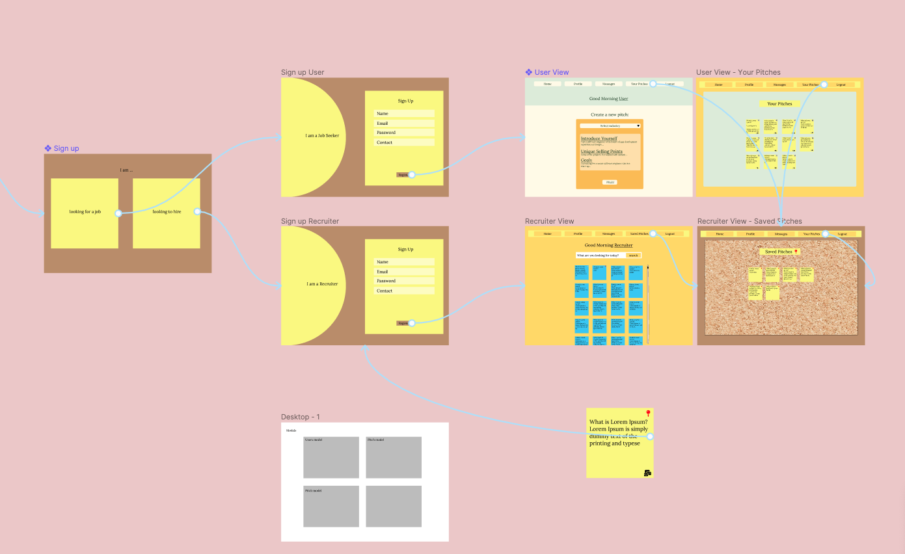
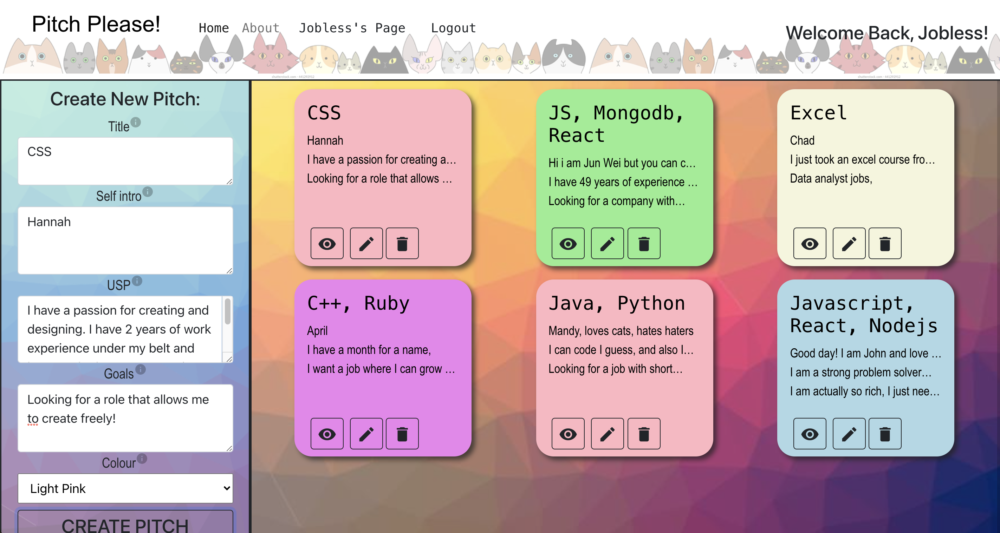
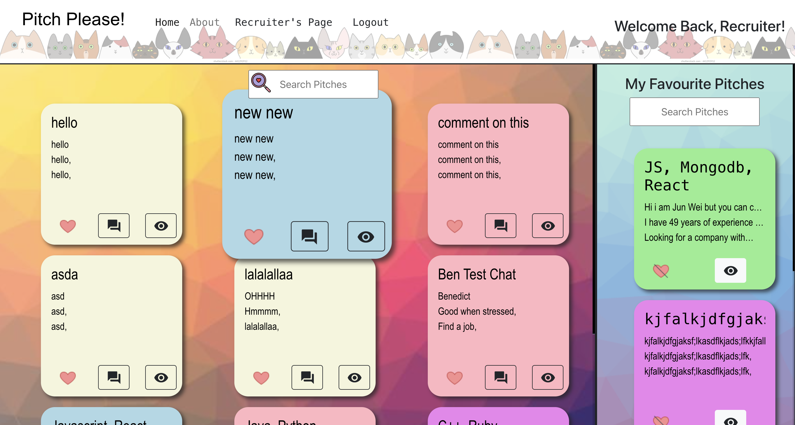
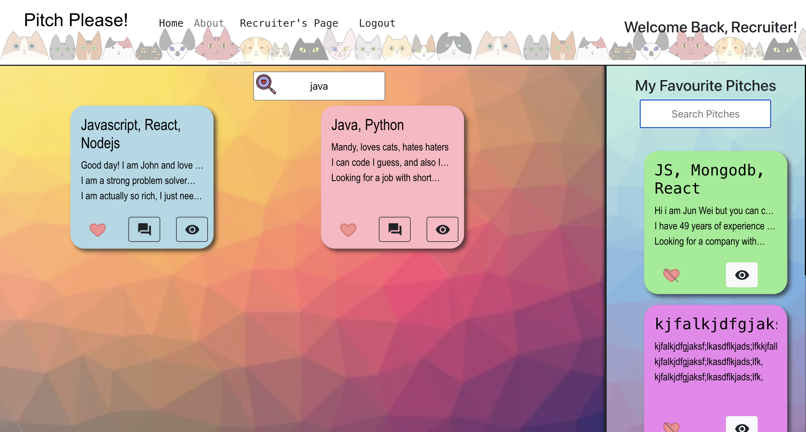

# Pitch Please!

## Description

Pitch Please is a platform for like minded tech individuals to connect. Be it Recruiter or Job Seeker, we hope that our application can be the bridge that connects potential talents with companies based only on a single post-it elevator pitch. No photos, no judgement, just give us your Pitch Please!

### Technologies Used

- React
- Bootstrap with react
- Ajax (axios) for API calls
- Passport authentication
- MongoDB
- Mongoose
- Material
- Tippy.js
- Pusher

### Wireframes

#### Initial planning with rough sketches for wire framing 

#### Plan for component paths 

### User Stories

User(Job Seeker) must be able to:

- Easily locate and register/sign up for an account on Pitch Please.
- Intuitively create a pitch and post/draft it to their pitch list once signed up/logged in.
- Be able to communicate with Recruiter when recruiter reaches out.

User(Recruiter) must be able to:
- Easily locate and register/sign up for an account on Pitch Please.
- Search for pitches by category. (e.g. React, Javascript)
- Add favourite pitches to their Short List.
- Make contact with Job Seekers.

---

## Planning and Development Process

Phase 1: Pre-Project week 
Discuss on potential project ideas and shortlist the best few. Eventually decided on our current project Pitch Please.
After discussing as a group what we foresee the app to need, each member was delegated a task to further research upon.

Applications like Trello and Figma was used to help us plan and delegate work.

#### Trello, a kanban board tool allowing better planning and clarity 

#### More detailed design work with Figma. Planning colours for the theme of our app 

Phase 2: First half of Project Week 
We knew from previous experience that it was important to have a good foundation to build upon.

We agreed upon what was required for the backend (models, routes, etc), before proceeding with component creation on React.

Rough layout and main components were created, alongside the paths that linked the frontend together. Once that was done, we could finally link both front and backends together to start mapping our information to be displayed on the frontend.

Some functions we implemented:

Separate dashboards for Job seekers and Recruiters, including different funcitonality for the Post-it pitches.

#### Job Seeker view 

#### Recruiter view 

#### Search function 

Phase 3: The final stretch; Finishing up the Project 
By Thursday we were 90% done. All that was left was to continue working on our chat function and polish the site's CSS.

### Problem-Solving Strategy

Working on our problems together helped the team understand different complexities of the different components in the project.

It was the first time any of us were attempting to implement a live chat. Hence it was difficult understanding its complexities.
We tried our best to break down this daunting task into smaller problems that we could take on and slowly worked our way up.

Many heads tackling a single problem made project progression much smoother.

### Unsolved problems

We were still unable to implement a realtime chat with react redux. We tried our best to implement it without redux but could not. Currently, all chats are non user specific as well.

---
